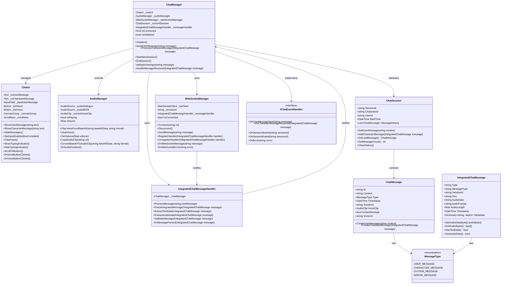
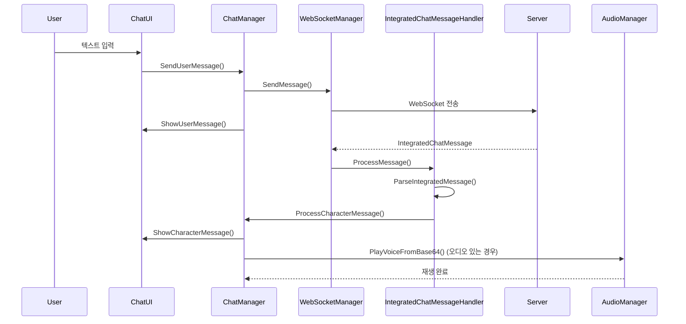

# 대화 시스템 설계 문서 v2

이 문서는 ProjectVG의 비주얼 노벨 스타일 대화 시스템 설계를 정의합니다.

---

## 시스템 요구사항

### 핵심 기능
1. **ChatManager**: 전체 대화 흐름 조율 (유저 입력 ↔ 서버 응답)
2. **유저 입력**: 텍스트 기반 메시지 전송
3. **ChatUI**: 유저 메시지와 캐릭터 메시지 구별 표시
4. **비동기 처리**: WebSocket을 통한 실시간 메시지 수신
5. **통합 메시지**: 텍스트 + 오디오 데이터 통합 처리

---

## 클래스 다이어그램



---

## 파일 구조 설계

```
Assets/
├── Domain/Chat/
│   ├── Script/
│   │   ├── ChatManager.cs                    # 메인 매니저
│   │   ├── ChatSession.cs                    # 세션 관리
│   │   ├── ChatMessage.cs                    # 메시지 모델
│   │   ├── IChatEventHandler.cs              # 이벤트 인터페이스
│   │   └── Enums/
│   │       └── MessageType.cs                # 메시지 타입 열거형
│   ├── View/
│   │   ├── ChatUI.cs                         # UI 컨트롤러
│   │   ├── DialoguePanel.prefab              # 대화창 프리팹
│   │   └── InputPanel.prefab                 # 입력창 프리팹
│   └── Model/
│       └── ChatData.cs                       # 데이터 모델
├── Core/Audio/
│   ├── AudioManager.cs                       # 오디오 매니저
│   └── VoicePlayer.cs                        # 음성 재생 전용
├── Infrastructure/Network/
│   ├── Services/
│   │   ├── WebSocketManager.cs               # 웹소켓 매니저
│   │   └── IntegratedChatMessageHandler.cs   # 통합 메시지 핸들러
│   ├── Models/
│   │   └── IntegratedChatMessage.cs          # 통합 메시지 모델
│   └── DTOs/Chat/
│       ├── ChatRequest.cs                    # (기존 확장)
│       ├── ChatResponse.cs                   # (기존 확장)
│       └── IntegratedChatMessage.cs           # 통합 메시지 모델
└── UI/Panels/
    └── ChatPanel.prefab                     # 채팅 패널 프리팹
```

---

## 주요 클래스 역할

### ChatManager
- **역할**: 전체 대화 흐름 조율 (유저 ↔ 서버)
- **책임**: 
  - 유저 입력 처리 및 전송
  - 서버 응답 수신 및 처리
  - UI 상태 관리
  - 오디오 재생 제어
  - 세션 관리

### ChatUI
- **역할**: 유저/캐릭터 메시지 구별 표시
- **책임**:
  - 유저 메시지 표시 (우측 정렬)
  - 캐릭터 메시지 표시 (좌측 정렬)
  - 입력 필드 관리
  - 스크롤 자동 조정
  - 타이핑 인디케이터

### WebSocketManager
- **역할**: 실시간 웹소켓 통신 관리
- **책임**:
  - 웹소켓 연결 관리
  - 메시지 송수신
  - 핸들러 등록/해제
  - 연결 상태 모니터링

### IntegratedChatMessageHandler
- **역할**: 통합 메시지 파싱 및 처리
- **책임**:
  - JSON 메시지 파싱
  - 텍스트/오디오 데이터 추출
  - 메시지 유효성 검증
  - ChatManager에 결과 전달

### AudioManager
- **역할**: Base64 오디오 데이터 재생
- **책임**:
  - Base64 → AudioClip 변환
  - 음성 재생 제어
  - 볼륨 관리
  - 재생 상태 모니터링

---

## 데이터 플로우



---

## 구현 우선순위

1. **Phase 1**: 기본 구조 및 모델
   - IntegratedChatMessage 모델
   - ChatManager 기본 구조
   - ChatUI 기본 UI (유저/캐릭터 구별)

2. **Phase 2**: 웹소켓 통신
   - WebSocketManager 구현
   - IntegratedChatMessageHandler 구현
   - 기본 메시지 송수신

3. **Phase 3**: 오디오 시스템
   - AudioManager Base64 처리
   - 음성 재생 기능
   - 오디오 포맷 지원

4. **Phase 4**: 고급 기능
   - 세션 관리
   - 에러 처리
   - 메시지 히스토리 