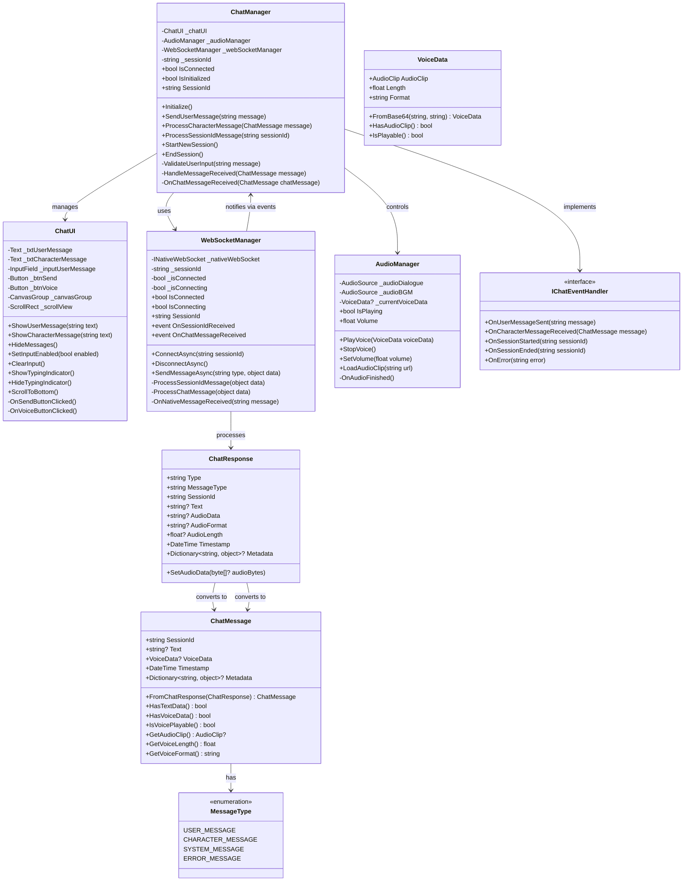
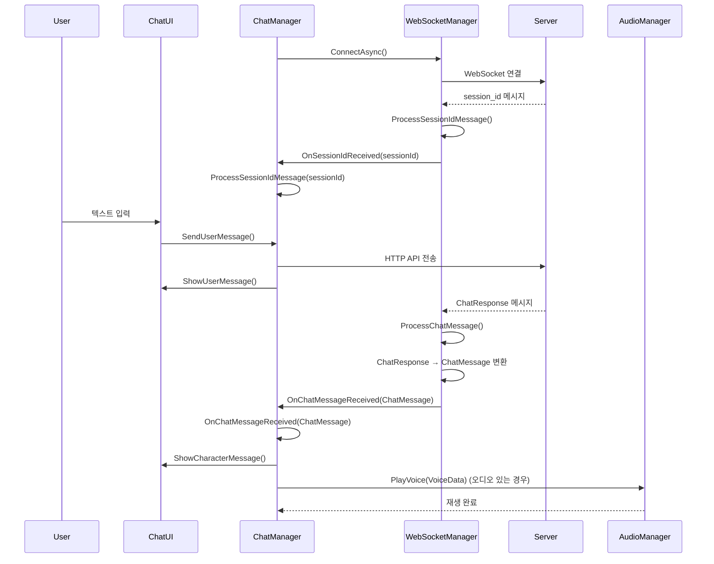

# 대화 시스템 설계 문서 v2

이 문서는 ProjectVG의 비주얼 노벨 스타일 대화 시스템 설계를 정의합니다.

---

## 시스템 요구사항

### 핵심 기능
1. **ChatManager**: 전체 대화 흐름 조율 (유저 입력 ↔ 서버 응답)
2. **유저 입력**: 텍스트 기반 메시지 전송
3. **ChatUI**: 유저 메시지와 캐릭터 메시지 구별 표시
4. **비동기 처리**: WebSocket을 통한 실시간 메시지 수신
5. **통합 메시지**: 텍스트 + 오디오 데이터 통합 처리
6. **세션 관리**: WebSocket 연결 시 세션ID 자동 수신 및 관리

---

## 클래스 다이어그램



---

## 파일 구조 설계

```
Assets/
├── Domain/Chat/
│   ├── Script/
│   │   ├── ChatManager.cs                    # 메인 매니저
│   │   ├── ChatMessage.cs                    # 메시지 모델
│   │   ├── VoiceData.cs                      # 음성 데이터 구조
│   │   ├── IChatEventHandler.cs              # 이벤트 인터페이스
│   │   └── Enums/
│   │       └── MessageType.cs                # 메시지 타입 열거형
│   ├── View/
│   │   ├── ChatUI.cs                         # UI 컨트롤러
│   │   ├── DialoguePanel.prefab              # 대화창 프리팹
│   │   └── InputPanel.prefab                 # 입력창 프리팹
├── Core/Audio/
│   ├── AudioManager.cs                       # 오디오 매니저
│   └── VoicePlayer.cs                        # 음성 재생 전용
├── Infrastructure/Network/
│   ├── Services/
│   │   ├── WebSocketManager.cs               # 웹소켓 매니저
│   │   └── ChatApiService.cs                 # HTTP API 서비스
│   ├── WebSocket/
│   │   ├── INativeWebSocket.cs               # 네이티브 웹소켓 인터페이스
│   │   └── Platforms/
│   │       ├── DesktopWebSocket.cs           # 데스크톱 웹소켓
│   │       └── MobileWebSocket.cs            # 모바일 웹소켓
│   └── DTOs/Chat/
│       ├── ChatRequest.cs                    # HTTP 요청 DTO
│       └── ChatResponse.cs                   # HTTP 응답 DTO
└── UI/Panels/
    └── ChatPanel.prefab                     # 채팅 패널 프리팹
```

---

## 주요 클래스 역할

### ChatManager
- **역할**: 전체 대화 흐름 조율 (유저 ↔ 서버)
- **책임**: 
  - 유저 입력 처리 및 전송
  - 서버 응답 수신 및 처리 (ChatResponse → ChatMessage 변환)
  - 세션ID 관리 (ProcessSessionIdMessage)
  - UI 상태 관리
  - 오디오 재생 제어 (VoiceData 기반)
  - 세션 관리

### WebSocketManager
- **역할**: 실시간 웹소켓 통신 관리
- **책임**:
  - 웹소켓 연결 관리
  - 메시지 송수신
  - 세션ID 메시지 처리 (ProcessSessionIdMessage)
  - 채팅 메시지 처리 (ProcessChatMessage)
      - ChatResponse 기반 이벤트 발생
  - 연결 상태 모니터링

### ChatUI
- **역할**: 유저/캐릭터 메시지 구별 표시
- **책임**:
  - 유저 메시지 표시 (우측 정렬)
  - 캐릭터 메시지 표시 (좌측 정렬)
  - 입력 필드 관리
  - 스크롤 자동 조정
  - 타이핑 인디케이터

### AudioManager
- **역할**: VoiceData 기반 오디오 재생
- **책임**:
  - VoiceData → AudioClip 재생
  - 음성 재생 제어
  - 볼륨 관리
  - 재생 상태 모니터링

---

## 데이터 모델 정의

### ChatResponse (서버 응답 데이터 구조)
```csharp
namespace ProjectVG.Infrastructure.Network.DTOs.Chat
{
    [Serializable]
    public class ChatResponse
    {
        [JsonProperty("type")]
        public string Type { get; set; } = "chat";
        
        [JsonProperty("message_type")]
        public string MessageType { get; set; } = "json";
        
        [JsonProperty("session_id")]
        public string SessionId { get; set; } = string.Empty;
        
        [JsonProperty("text")]
        public string? Text { get; set; }
        
        [JsonProperty("audio_data")]
        public string? AudioData { get; set; }
        
        [JsonProperty("audio_format")]
        public string? AudioFormat { get; set; } = "wav";
        
        [JsonProperty("audio_length")]
        public float? AudioLength { get; set; }
        
        [JsonProperty("timestamp")]
        public DateTime Timestamp { get; set; } = DateTime.UtcNow;
        
        [JsonProperty("metadata")]
        public Dictionary<string, object>? Metadata { get; set; }
    }
}
```

### VoiceData (음성 데이터 구조)
```csharp
namespace ProjectVG.Domain.Chat
{
    [Serializable]
    public class VoiceData
    {
        public AudioClip AudioClip { get; set; }
        public float Length { get; set; }
        public string Format { get; set; } = "wav";
        
        public VoiceData(AudioClip audioClip, float length, string format = "wav")
        {
            AudioClip = audioClip;
            Length = length;
            Format = format;
        }
        
        public VoiceData()
        {
        }
        
        // Base64 문자열에서 VoiceData 생성
        public static VoiceData FromBase64(string base64Data, string format = "wav")
        {
            if (string.IsNullOrEmpty(base64Data))
                return null;
                
            try
            {
                byte[] audioBytes = Convert.FromBase64String(base64Data);
                AudioClip audioClip = ConvertBytesToAudioClip(audioBytes, format);
                
                if (audioClip != null)
                {
                    return new VoiceData(audioClip, audioClip.length, format);
                }
            }
            catch (Exception ex)
            {
                Debug.LogError($"Base64에서 AudioClip 변환 실패: {ex.Message}");
            }
            
            return null;
        }
        
        // AudioClip이 있는지 확인
        public bool HasAudioClip() => AudioClip != null;
        
        // 재생 가능한지 확인
        public bool IsPlayable() => HasAudioClip() && Length > 0;
    }
}
```

### ChatMessage (내부 사용 데이터 구조)
```csharp
namespace ProjectVG.Domain.Chat
{
    [Serializable]
    public class ChatMessage
    {
        public string SessionId { get; set; } = string.Empty;
        public string? Text { get; set; }
        public VoiceData? VoiceData { get; set; }
        public DateTime Timestamp { get; set; } = DateTime.UtcNow;
        public Dictionary<string, object>? Metadata { get; set; }
        
        // ChatResponse에서 ChatMessage로 변환하는 팩토리 메서드
        public static ChatMessage FromChatResponse(ChatResponse response)
        {
            var chatMessage = new ChatMessage
            {
                SessionId = response.SessionId,
                Text = response.Text,
                Timestamp = response.Timestamp,
                Metadata = response.Metadata
            };
            
            // Base64 오디오 데이터를 VoiceData로 변환
            if (!string.IsNullOrEmpty(response.AudioData))
            {
                chatMessage.VoiceData = VoiceData.FromBase64(response.AudioData, response.AudioFormat);
            }
            
            return chatMessage;
        }
        
        // 오디오 데이터가 있는지 확인
        public bool HasVoiceData() => VoiceData != null && VoiceData.IsPlayable();
        
        // 텍스트 데이터가 있는지 확인
        public bool HasTextData() => !string.IsNullOrEmpty(Text);
        
        // AudioClip 가져오기
        public AudioClip? GetAudioClip() => VoiceData?.AudioClip;
    }
}
```


## 데이터 플로우



---

## 메시지 처리 흐름

### 1. 세션ID 처리 흐름
1. **WebSocket 연결**: ChatManager가 WebSocketManager.ConnectAsync() 호출
2. **세션ID 수신**: 서버에서 session_id 타입 메시지 전송
3. **메시지 처리**: WebSocketManager.ProcessSessionIdMessage() 처리
4. **이벤트 발생**: OnSessionIdReceived 이벤트 발생
5. **ChatManager 처리**: ChatManager.ProcessSessionIdMessage() 호출
6. **세션 저장**: ChatManager가 세션ID 저장 및 관리

### 2. 채팅 메시지 처리 흐름
1. **메시지 수신**: 서버에서 chat 타입 메시지 전송
2. **ChatResponse 파싱**: WebSocketManager.ProcessChatMessage() 처리
3. **ChatMessage 변환**: ChatResponse → ChatMessage 변환
4. **이벤트 발생**: OnChatMessageReceived(ChatMessage) 이벤트 발생
5. **ChatManager 처리**: ChatManager.OnChatMessageReceived(ChatMessage) 호출
6. **UI 업데이트**: ChatUI.ShowCharacterMessage() 호출
7. **오디오 재생**: AudioManager.PlayVoice(VoiceData) 호출 (있는 경우)

## 구현 우선순위

1. **Phase 1**: 기본 구조 및 모델
   - ChatMessage 모델 (Domain/Chat/Script/)
   - VoiceData 모델 (Domain/Chat/Script/)
   - ChatManager 기본 구조 (세션ID 처리 포함)
   - ChatUI 기본 UI (유저/캐릭터 구별)

2. **Phase 2**: 웹소켓 통신
   - WebSocketManager 구현 (ProcessSessionIdMessage, ProcessChatMessage)
   - ChatResponse DTO 정의
   - 기본 메시지 송수신

3. **Phase 3**: 오디오 시스템
   - AudioManager VoiceData 처리
   - 음성 재생 기능
   - 오디오 포맷 지원

4. **Phase 4**: 고급 기능
   - 세션 관리
   - 에러 처리
   - 메시지 히스토리 