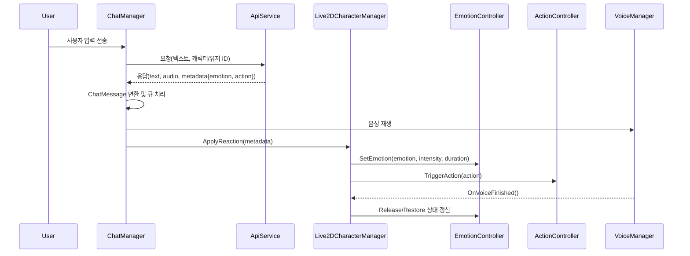
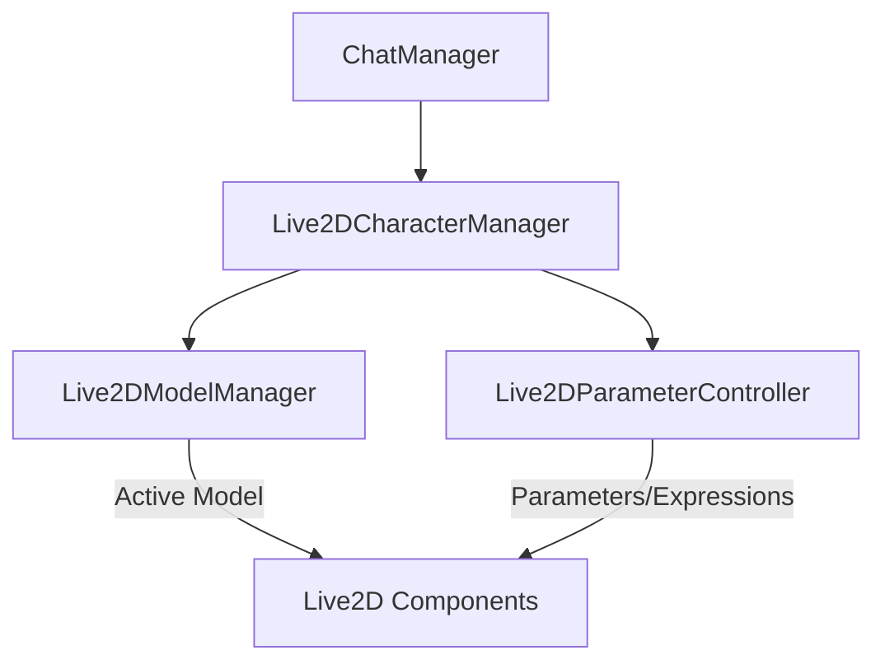

## Live2D 연동 Service 설계 (Emotion/Action 중심)

### 목적
- **캐릭터 반응**: 서버로부터 수신한 텍스트, 음성, 감정(Emotion), 행동(Action) 정보를 바탕으로 Live2D 캐릭터의 표정/모션/상태를 변경한다.
- **모듈화/확장성**: 감정/행동 처리를 각각 모듈로 분리하여 맵핑과 우선순위 정책을 유연하게 확장한다.
- **일관된 상태관리**: 음성 재생, 감정 지속시간, 행동 트리거 등 비동기 이벤트를 단일 상태 모델에서 일관되게 관리한다.

### 범위
- 포함: 감정/행동 파이프라인 설계, 상태관리, Live2D SDK 연동 포인트, 데이터 매핑 규칙, 테스트 전략, 단계별 구현 로드맵
- 제외: 정교한 액션 모션 구현(더미 처리), 고급 물리/파라미터 튜닝, 에디터 툴링(UI)

### 용어 및 데이터 모델
- **Emotion**: 캐릭터의 표정/감정 상태를 표현. 예: Neutral, Happy, Sad, Angry, Surprised 등
- **Action**: 캐릭터의 몸짓/행동 트리거. 예: Nod, ShakeHead, WaveHand 등(현재 더미)
- **ChatResponse.Metadata**: 서버가 감정/행동 정보를 담아 보내는 확장 필드. 제안 키:
  - `emotion`: string (예: "happy")
  - `emotion_intensity`: float 0~1
  - `emotion_duration_ms`: int
  - `action`: string (예: "wave_hand")
  - `action_args`: object

### 전체 아키텍처 개요
- **ChatManager**: 서버 왕복, 메시지 큐 및 음성/버블 표시. 수신 메시지를 감정/행동 파이프라인으로 라우팅.
- **Live2DCharacterManager**: 캐릭터 상태의 단일 진입점. Emotion/Action 컨트롤러를 보유하고 우선순위/병행 정책 적용.
- **EmotionController**: 감정 → Live2D Expression 맵핑/블렌딩/지속시간/해제 관리.
- **ActionController**: 행동 → Live2D Motion/Parameter 트리거. 현재 더미.
- **VoiceManager(기존)**: 음성 재생 및 완료 이벤트 발생.
- **ChatBubbleManager(기존)**: 대화 버블 표시.



이미지 버전: `Assets/Docs/diagrams/live2d_sequence.svg` / `Assets/Docs/diagrams/live2d_sequence.png`


### 상태 관리 설계
- **CharacterStateModel** 제안 필드
  - `currentEmotion`, `pendingEmotion`, `emotionIntensity`, `emotionExpireAt`
  - `currentAction`, `actionPlaying`, `actionExpireAt`
  - `isVoicePlaying`
- **우선순위(초안)**
  - Action > Voice Gating > Emotion 순으로 적용. 예: 강한 액션은 진행 중 감정을 일시 덮어씀.
  - Voice 재생 중 과격한 표정 전환은 완화(블렌드 타임 증가) 또는 대기열로 보관.
- **시간/블렌딩**
  - 감정은 `duration` 동안 유지 후 `Neutral`로 복귀. 블렌드 인/아웃 시간 설정.
  - 액션은 모션 길이 동안 `actionPlaying=true`, 종료 시 이전 감정 복원.

### Live2D SDK 연동 포인트
- Expression: `CubismExpressionController.CurrentExpressionIndex` 또는 이름 기반 선택. 감정 → Expression 이름/인덱스 맵 필요.
- Motion: 추후 `CubismMotionController` 또는 모션 그룹 기반 트리거. 현재는 더미 처리(로그/플래그).
- Parameter(선택): 입모양/깜박임 등은 차후 `Voice` 파형 기반 드라이브(범위 외).

### Live2D 모델 관리자 / 파라미터 컨트롤러 설계
- **Live2DModelManager**
  - 역할: 모델 로드/언로드, 프리로드, 활성 모델 전환, 표시/비표시, 컴포넌트 접근
  - 고려: 풀링, 프리로딩, 비동기 로드, 메모리 관리, 품질/성능(텍스처 압축/샘플링, MipMap, LOD)
- **Live2DParameterController**
  - 역할: 파라미터 직접 제어(Set/Blend/Reset), 프리셋 적용(감정/액션의 파라미터 세트), 업데이트 루프에서 블렌딩 처리
  - 고려: 충돌해결(우선순위/레이어), 블렌드 커브, 최대/최소 클램프, 이름→ID 매핑 캐시
- **Live2DCharacterManager**
  - 역할: 상위 조정자. 모델 관리자/파라미터 컨트롤러를 묶어 감정/행동 반응을 일관되게 적용
  - 정책: Action > Voice > Emotion 우선순위, 지속시간/블렌드 관리, 구성 자산 기반 매핑



이미지 버전: `Assets/Docs/diagrams/live2d_architecture.svg` / `Assets/Docs/diagrams/live2d_architecture.png`


### 모듈 API 초안 (스켈레톤 중심)
```csharp
/** 모델 전반의 상태를 단일 진입점에서 관리한다. */
public interface ILive2DModelManagerFacade
{
    void Initialize();
    void ApplyReaction(EmotionData emotionData, ActionData actionData);
    void OnVoiceStarted();
    void OnVoiceFinished();
}

/** 감정 → Expression 맵핑과 블렌딩을 담당한다. */
public interface IEmotionController
{
    void Initialize();
    void SetEmotion(string emotion, float intensity, int durationMs);
    void ClearEmotion();
}

/** 행동 → 모션/파라미터 트리거를 담당한다. */
public interface IActionController
{
    void Initialize();
    void TriggerAction(string action, object args = null);
}

/** 감정/행동 데이터 전달을 위한 단순 DTO. */
public struct EmotionData { public string Emotion; public float Intensity; public int DurationMs; }
public struct ActionData { public string Action; public object Args; }
```

### 메시지 매핑 규칙
- ChatResponse → ChatMessage 변환 시 `metadata`에서 감정/행동 추출.
- 누락/알 수 없는 값은 안전한 기본값 적용:
  - emotion 미지정: `neutral`
  - intensity 누락: `0.5f`
  - duration 누락: `2000ms`
  - action 미지정: 처리 없음

### 에러 처리 및 로깅
- 알 수 없는 emotion/action은 경고 로그와 함께 무시. 매핑 테이블에 기록하여 추후 보강.
- Live2D 컴포넌트 결여 시 초기화 단계에서 명시적 오류.

### 테스트 전략
- 단위 테스트
  - Emotion 맵핑: 입력 emotion → 예상 Expression 식별자
  - 상태 머신: 음성 재생 중 감정 대기/복원, 액션 우선 적용
- 통합 테스트
  - ChatManager 이벤트 플로우에서 ApplyReaction 호출 여부
  - 음성 종료 이벤트 후 상태 정상 복원

### 구성/데이터 자산
- `Live2DModelConfig`(ScriptableObject 제안)
  - `Emotion → ExpressionKey` 사전
  - `Action → MotionKey` 사전(더미 가능)
  - 블렌드/지속 기본값, 우선순위 정책

### 단계별 로드맵(점진 구현)
1) 스켈레톤 클래스/인터페이스 추가 및 DI 연결
2) EmotionController 최소 맵핑(Neutral/Happy 등)과 블렌드 기본값
3) ChatManager → Live2DCharacterManager 라우팅 연결, Voice 이벤트 연동
4) ActionController 더미 트리거(로그/플래그) 및 상태 복원
5) 구성 자산(SO) 도입, 맵 테이블 외부화
6) 모션 컨트롤러 연동 및 액션 일부 실제 재생

### 오픈 이슈
- 라이브2D 모션 자산命名/그룹 규칙 확정 필요
- 감정 우선순위 정책의 UX 적정값(블렌드/지속) 튜닝 필요
- 서버 메타데이터 스키마 확정 및 계약 문서화 필요


