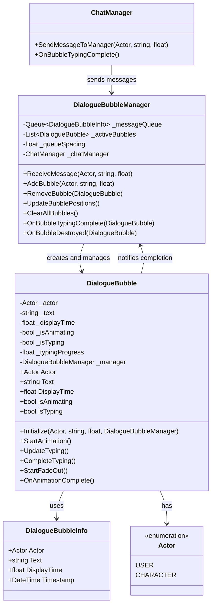
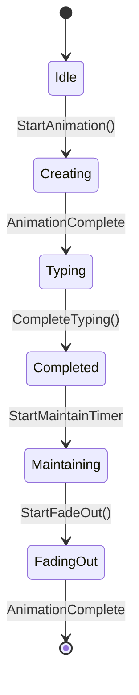

# DialogueBubble 설계 문서

이 문서는 ProjectVG의 대화 시스템에서 사용되는 DialogueBubble 컴포넌트의 설계를 정의합니다.

---

## 컴포넌트 개요

**DialogueBubbleManager**는 ChatManager로부터 대화 데이터를 받아서 **DialogueBubble**들을 생성하고 관리하는 메인 컨트롤러입니다. 개별 **DialogueBubble**은 토스트 애니메이션 형태로 대화창을 표시하며, Actor 타입에 따라 다른 형태와 애니메이션을 제공합니다.

---

## 핵심 컴포넌트 구조

### 1. **DialogueBubbleManager** (메인 컨트롤러)
- ChatManager로부터 메시지 데이터 수신
- DialogueBubble 생성 및 Queue 관리
- 애니메이션 타이밍과 순서 제어
- ChatManager와의 통신 담당

### 2. **DialogueBubble** (개별 대화창)
- 개별 대화창의 애니메이션과 표시
- Actor별 스타일 적용 (User/Character)
- 텍스트 타이핑 효과
- 자체 생명주기 관리

### 3. **DialogueBubbleInfo** (데이터 모델)
- Actor, Text, DisplayTime 등 메시지 정보

---

## 핵심 기능 요구사항

### 1. 데이터 구조
- **Actor**: User, Character 구분
- **Text**: 표시할 메시지 내용
- **DisplayTime**: 텍스트 출력 시간

### 2. 트리거 방식
- **DialogueBubbleManager**가 ChatManager로부터 메시지 전달 받음
- 메시지 수신 → DialogueBubble 생성 → 애니메이션 시작

### 3. 애니메이션 플로우
1. **생성**: 밑에서 위로 토스트 애니메이션으로 대화창 생성
2. **텍스트 출력**: Actor에 따른 텍스트 출력 방식
   - User: 즉시 출력
   - Character: 타이핑 효과 (DisplayTime 동안)
3. **완료 알림**: 텍스트 출력 완료 시 ChatManager에 알림
4. **유지**: 3초간 대화창 유지
5. **제거**: Pageout 애니메이션으로 사라짐

### 4. Actor별 대화창 형태
- **User**: 우측 정렬, 사용자 스타일
- **Character**: 좌측 정렬, 캐릭터 스타일

### 5. Queue 관리
- 대화창들이 아래에서 위로 쌓이는 구조
- 채팅 형태의 메시지 히스토리 관리

---

## 클래스 구조



---

## 데이터 모델

### Actor 열거형
```csharp
public enum Actor
{
    User,       // 사용자 메시지
    Character   // 캐릭터 메시지
}
```

### DialogueBubbleInfo
```csharp
[System.Serializable]
public class DialogueBubbleInfo
{
    public Actor Actor { get; set; }
    public string Text { get; set; }
    public float DisplayTime { get; set; }
    public DateTime Timestamp { get; set; }
    
    public DialogueBubbleInfo(Actor actor, string text, float displayTime)
    {
        Actor = actor;
        Text = text;
        DisplayTime = displayTime;
        Timestamp = DateTime.UtcNow;
    }
}
```

---

## 애니메이션 상태 머신



### 상태 설명
1. **Idle**: 초기 상태
2. **Creating**: 토스트 애니메이션으로 생성 중
3. **Typing**: 텍스트 타이핑 중 (Character만)
4. **Completed**: 텍스트 출력 완료
5. **Maintaining**: 대화창 유지 중 (3초)
6. **FadingOut**: 사라지는 애니메이션 중

---

## 파일 구조

```
Assets/
├── Domain/Chat/
│   ├── View/
│   │   ├── DialogueBubbleManager.cs        # 메인 컨트롤러
│   │   ├── DialogueBubble.cs               # 개별 대화창 컴포넌트
│   │   ├── DialogueBubble.prefab           # 대화창 프리팹
│   │   └── DialogueBubbleInfo.cs           # 데이터 모델
│   └── Enums/
│       └── Actor.cs                        # Actor 열거형
├── UI/Panels/
│   └── DialoguePanel.prefab                # 대화 패널 프리팹
```

---

## 주요 메서드

### DialogueBubbleManager (메인 컨트롤러)
```csharp
public class DialogueBubbleManager : MonoBehaviour
{
    // ChatManager로부터 메시지 수신
    public void ReceiveMessage(Actor actor, string text, float displayTime)
    
    // 새 대화창 추가
    private void AddBubble(Actor actor, string text, float displayTime)
    
    // 대화창 제거
    public void RemoveBubble(DialogueBubble bubble)
    
    // 위치 업데이트
    private void UpdateBubblePositions()
    
    // 모든 대화창 제거
    public void ClearAllBubbles()
    
    // 타이핑 완료 콜백
    public void OnBubbleTypingComplete(DialogueBubble bubble)
    
    // 대화창 제거 완료 콜백
    public void OnBubbleDestroyed(DialogueBubble bubble)
}
```

### DialogueBubble (개별 대화창)
```csharp
public class DialogueBubble : MonoBehaviour
{
    // 초기화
    public void Initialize(Actor actor, string text, float displayTime, DialogueBubbleManager manager)
    
    // 애니메이션 시작
    public void StartAnimation()
    
    // 타이핑 업데이트
    private void UpdateTyping()
    
    // 타이핑 완료
    public void CompleteTyping()
    
    // 페이드아웃 시작
    public void StartFadeOut()
    
    // 애니메이션 완료 콜백
    private void OnAnimationComplete()
}
```

---

## 이벤트 시스템

### DialogueBubbleManager 이벤트
```csharp
public event Action<DialogueBubble> OnBubbleAdded;
public event Action<DialogueBubble> OnBubbleRemoved;
public event Action OnAllBubblesCleared;
public event Action<DialogueBubble> OnBubbleTypingComplete;
```

### DialogueBubble 이벤트
```csharp
public event Action<DialogueBubble> OnBubbleCreated;
public event Action<DialogueBubble> OnBubbleTypingComplete;
public event Action<DialogueBubble> OnBubbleDestroyed;
```

---

## 구현 우선순위

1. **Phase 1**: 기본 구조
   - Actor 열거형 정의
   - DialogueBubbleInfo 모델
   - DialogueBubbleManager 기본 구조
   - DialogueBubble 기본 구조

2. **Phase 2**: 애니메이션 시스템
   - 토스트 생성 애니메이션
   - 타이핑 효과
   - 페이드아웃 애니메이션

3. **Phase 3**: Queue 관리
   - DialogueBubbleManager Queue 구현
   - 위치 계산 및 정렬

4. **Phase 4**: 통합 및 최적화
   - ChatManager 연동
   - 성능 최적화
   - 에러 처리

---

## 사용 예시

```csharp
// ChatManager에서 DialogueBubbleManager로 메시지 전송
dialogueBubbleManager.ReceiveMessage(Actor.User, "안녕하세요!", 2.0f);
dialogueBubbleManager.ReceiveMessage(Actor.Character, "안녕하세요! 반갑습니다.", 3.0f);
```

---

이 설계를 바탕으로 DialogueBubble 컴포넌트를 구현할 수 있습니다. 