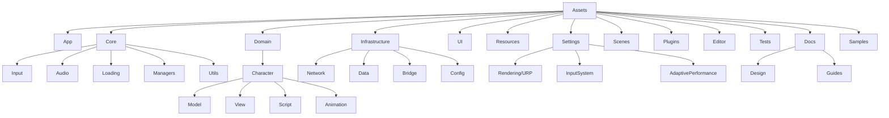

# ProjectVG Unity 프로젝트 구조 가이드

```text
Assets/
├─ App/                                 - 앱 엔트리, 전역 부트스트랩
│  └─ Scenes/                           - 앱/메인/로딩 씬
├─ Core/                                - 공통 런타임 모듈
│  ├─ Input/                            - 입력 매니저/라우팅(ScreenTapManager 등)
│  ├─ Audio/                            - 오디오 매니저/레코더/보이스
│  ├─ Loading/                          - 로딩/씬 전환 유틸
│  ├─ Managers/                         - 초기화/DI/레지스트리(System/Dependency)
│  └─ Utils/                            - 범용 유틸/싱글톤
├─ Domain/                              - 기능(도메인)별 코드/자산
│  ├─ Character/
│  │  ├─ Model/                         - Live2D 자산(.moc3/.json/Prefab/Motions/Expressions)
│  │  ├─ View/                          - 캐릭터 프리팹/뷰 스크립트
│  │  ├─ Script/                        - 컨트롤러/매니저/컴포넌트/Config SO
│  │  └─ Animation/                     - 타임라인/모션 클립
│  └─ Chat/
│     ├─ Script/                        - 채팅 로직/서비스 연동
│     ├─ View/                          - UI 프리팹/스크립트
│     └─ Model/                         - 데이터 모델/DTO
├─ Infrastructure/                      - 외부 연동/저장/네트워크
│  ├─ Network/                          - Http/WS 클라이언트, Services, DTOs, Configs
│  ├─ Data/                             - 로컬 저장 래퍼(SaveData/PlayerPrefs)
│  ├─ Bridge/                           - 네이티브/외부 SDK 브리지
│  └─ Config/                           - 실행환경 설정 SO(AppEnvironmentConfig 등)
├─ UI/                                  - 공용 UI 리소스
│  ├─ Panels/                           - 화면 단위 패널 프리팹
│  ├─ Prefabs/                          - 공용 UI 프리팹
│  ├─ Scripts/                          - UI 상호작용 스크립트
│  ├─ Transitions/                      - 전환 효과(페이드/이동 등)
│  └─ Fonts/                            - 폰트/머티리얼
├─ Resources/                           - Resources.Load 대상(필요 최소)
│  ├─ App/                              - 앱 공용 리소스
│  └─ Character/                        - 레지스트리/모델 등록 SO
├─ Settings/                            - 프로젝트 설정 자산
│  ├─ Rendering/
│  │  └─ URP/                           - URP 에셋/글로벌 설정/Renderer2D
│  ├─ InputSystem/                      - .inputactions
│  └─ Adaptive Performance/             - 프로바이더/프로필 자산
├─ Scenes/                              - 공용/샘플 씬
├─ Plugins/                             - 외부 SDK/라이브러리
│  ├─ Live2D/                           - Cubism SDK
│  └─ TextMesh Pro/                     - TMP 패키지 리소스
├─ Editor/                              - 에디터 전용 스크립트
├─ Tests/                               - 테스트
│  ├─ Editor/                           - 에디터 테스트
│  └─ Runtime/                          - 플레이모드/유닛 테스트
├─ Docs/                                - 문서
│  ├─ Design/                           - 설계/다이어그램
│  └─ Guides/                           - 가이드/규칙
└─ Samples/                             - 샘플 코드/리소스
   └─ Core/
      └─ Managers/                      - 샘플 매니저 스크립트
```



## 최상위 디렉토리
| 경로 | 용도 | 예시 |
|---|---|---|
| Assets/App | 엔트리/앱 전역 흐름 | App.cs, App/Scenes |
| Assets/Core | 공통 기능(엔진 독립) | Audio, Input, Loading, Managers, Utils |
| Assets/Domain | 기능(도메인)별 코드/자산 | Character, Chat, Popup |
| Assets/Infrastructure | 외부 연동/저장/네트워크 | Network, Data, Bridge, Config |
| Assets/UI | 공용 UI 리소스 | Panels, Prefabs, Scripts, Transitions, Fonts |
| Assets/Resources | 런타임 Resources.Load 대상 | Config assets, Registries |
| Assets/Settings | 프로젝트 설정 자산 | Rendering/URP, InputSystem, AdaptivePerformance |
| Assets/Scenes | 공용 씬(샘플/공통) | SampleScene, DevScene |
| Assets/Plugins | 외부 SDK/라이브러리 | Live2D, TextMesh Pro |
| Assets/Editor | 에디터 전용 코드 | Inspectors, MenuItems |
| Assets/Tests | 테스트 | Editor, Runtime |
| Assets/Docs | 문서 | Design, Guides, diagrams |
| Assets/Samples | 샘플 코드/리소스 | Core/Managers/SampleSystemManager.cs |

## Core 하위
| 경로 | 용도 | 비고 |
|---|---|---|
| Core/Input | 입력 처리 | ScreenTapManager |
| Core/Audio | 오디오 공통 | AudioManager, VoiceManager |
| Core/Loading | 로딩/씬 전환 | LoadingManager, SceneTransitionManager |
| Core/Managers | 초기화/DI/레지스트리 | InitializationManager, DependencyManager |
| Core/Utils | 범용 유틸 | Singleton 등 |

## Domain 하위(패턴)
| 경로 | 용도 | 예시 |
|---|---|---|
| Domain/<Feature>/Model | 모델 자산(겉모습) | Live2D .moc3/.json, Prefab, Motions |
| Domain/<Feature>/View | 뷰/프리팹 | UI/3D 프리팹 |
| Domain/<Feature>/Script | 로직/컨트롤러 | Manager, Controller, Component, Config |
| Domain/<Feature>/Animation | 타임라인/클립 | Playables, AnimClips |

## Infrastructure 하위
| 경로 | 용도 | 예시 |
|---|---|---|
| Infrastructure/Network | API/WS/HTTP | Services, DTOs, Configs |
| Infrastructure/Data | 로컬 저장 | SaveData, PlayerPrefs 래퍼 |
| Infrastructure/Bridge | 네이티브/외부 SDK 브리지 | Android/iOS glue |
| Infrastructure/Config | 실행환경 설정 | AppEnvironmentConfig |

## Settings vs Plugins
| 항목 | 내용 |
|---|---|
| Settings | 프로젝트 설정 자산(.asset, 프로필). 예: URP, InputSystem, Adaptive Performance |
| Plugins | 외부 기능 코드/리소스. 예: Live2D Cubism, TMP |

## 배치 규칙
- 스크립트: 기능 기준 배치(Domain/Core/Infrastructure/UI)
- 모델 자산: Domain/<Feature>/Model/<ModelId>/
- 설정 자산: Assets/Settings/**
- Resources: 런타임 강제 로드 대상만 배치(남용 금지)
- Addressables: 도입 시 Resources 대체, 키 규칙 Domain/Category/Name
- 샘플: Assets/Samples/**

## 씬 규칙
- 공용/샘플 씬: Assets/Scenes/**
- 기능 전용 씬: Domain/<Feature>/View 또는 Tests/Runtime/**
- 네이밍: PascalCase + 역할(Main/Loading/Dev/Sample)

## Addressables 키 규칙
- Domain/Category/Name
- 예: UI/Panels/PanelChat, Characters/Natori/Model

## 체크리스트
- 폴더/네임스페이스/파일명/타입명 일치
- Settings 자산 중앙화(URP/InputSystem/AdaptivePerformance)
- Model 자산 폴더 표준화(Character/Model/<ModelId>)
- 샘플/테스트 자산 분리(Samples, Tests)
